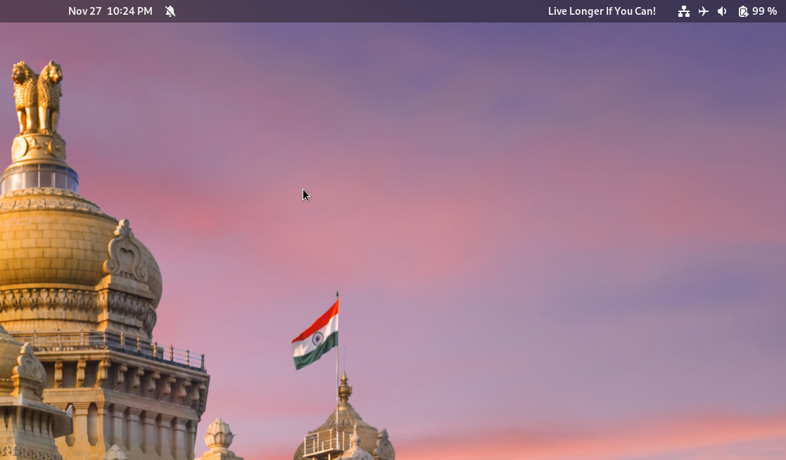

# Show Me The Text GNOME Shell Extension



A GNOME extension to show the desired text on the right-hand side of the top bar.

## Install

### Manually
You can download this repo and install it manually with the build script:

```bash
$ ./scripts/build.sh -i
```
*You need gettext package installed on your system*
## To change the text:

1. Open the `Extensions` application
2. Find the `Show Me The Text` extension
3. Open the `Settings` option


