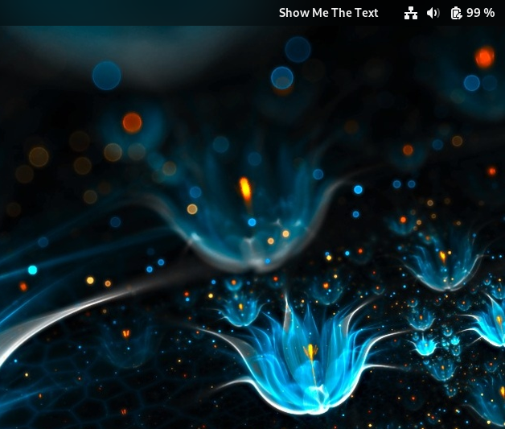
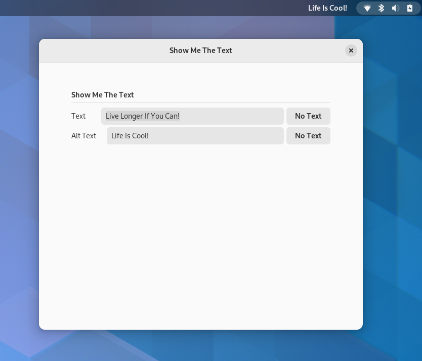

# Show Me The Text
[](https://extensions.gnome.org/extension/5556/show-me-the-text/)




A GNOME extension to show the desired text on the right-hand side of the top bar.

## Install

### GNOME Extensions Website

This extension is available on [GNOME Extensions Website](https://extensions.gnome.org/extension/5556/show-me-the-text/)
.

### Manually

You can download this repo and install it manually with the build script:

```bash
./scripts/build.sh -i
```

*You need gettext package installed on your system*

**Fedora**

`dnf install gettext`
    
**Ubuntu**

`apt install gettext`

## To change the text:

1. Open the `Extensions` application
2. Find the `Show Me The Text` extension
3. Open the `Settings` option




